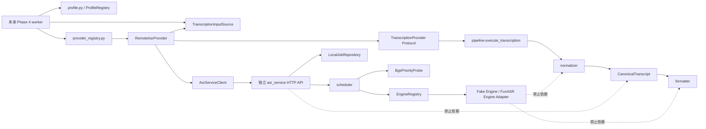

# 多引擎视频自动转录 Phase 3 详细实施计划

## 0. 文档状态与审批边界

- 当前状态：**R2 详细计划，已获用户批准进入代码实施**。
- 当前代码基线：`codex/multi-engine-transcription-phase2` 分支上已完成的 Phase 1/Phase 2 契约与持久化核心。
- 上位架构基线：
  - [多引擎视频自动转录总体方案](multi-engine-auto-transcription.md)
  - [ADR 0002：多引擎转录](../decisions/0002-multi-engine-transcription.md)
  - [Phase 1 详细计划](multi-engine-transcription-phase1.md)
  - [Phase 2 详细计划](multi-engine-transcription-phase2.md)
  - [FunASR 候选专项方案](funasr-auto-transcription.md)
- 若旧方案的实施状态、混合状态枚举或旧 Phase 划分与当前源码、Phase 1/Phase 2 详细计划冲突，以当前源码和对应详细计划为准。
- 批准本计划只授权本文件列出的 Phase 3 代码、测试、CI 和配置样例修改；不授权 Phase 4～Phase 6、生产部署、真实数据、模型下载、GPU 实测、SSH 或索引重建。
- 本计划获批后仍须按最小修改集实施、独立验证和提交；若实施中需要改变 Provider 主结果流、数据库 Schema、应用 API/UI、生产部署或真实引擎资格状态，必须停止并重新提交 R2/R3 方案。

## 1. 风险等级

**R2（中风险）**。

理由：

- 新增独立 ASR HTTP 服务、鉴权、作业状态机、文件型恢复、调度和远程 Provider 适配器；
- 扩展可信 Profile config、Provider Registry、配置变量和 CI；
- 涉及跨进程契约、长任务超时/取消、单卡资源边界及可恢复上传；
- 但本阶段不修改数据库 Schema，不接入管理员 API/UI，不运行真实模型，不访问生产或真实媒体，回滚可通过撤销新增包和局部配置改动完成。

## 2. Phase 3 目标

Phase 3 建立可在后续业务接线中复用的独立 ASR 服务和 Provider 适配层，使后端能够在不依赖具体引擎名称分支的前提下：

1. 通过服务端白名单 Profile 解析可信执行配置；
2. 通过独立 Provider Registry 获取请求级 Provider；
3. 将受控音频输入以可恢复、内容寻址的方式传给独立 `asr_service`；
4. 通过短 HTTP 请求创建、续传、启动、轮询、取消和获取结果；
5. 将服务结果严格重建为 `ProviderCandidate | ProviderFailure`；
6. 继续只通过现有 `execute_transcription()` 进入：

   ```text
   ProviderCandidate | ProviderFailure
   → pipeline 严格边界与异常归一化
   → normalize_candidate()
   → CanonicalTranscript
   → formatter
   ```

7. 在无 GPU、无真实模型、无网络的 CI 中验证全部协议、恢复、调度和边界；
8. 为 Phase 4 的应用 worker/API/UI 接线提供稳定端口，但本阶段不接线。

Phase 3 完成后仍不会产生管理员可见的自动转录能力。业务能力只有在 Phase 4 明确接入媒体输入、应用任务执行、管理 API/UI 后才可能出现。

## 3. 当前代码事实与调用链证据

### 3.1 Phase 1 主结果流已经冻结

`src/transcription/pipeline.py` 中的 `execute_transcription()` 是当前唯一 Provider 调用边界：

```text
TranscriptionProvider.transcribe(input_ref, execution_config)
→ ProviderCandidate | ProviderFailure
→ JSON 严格重建
→ input / execution / fingerprint 不可变检查
→ Candidate 与执行上下文一致性检查
→ normalize_candidate()
→ CanonicalTranscript
```

当前事实：

- Provider 不能返回 Canonical；
- Provider 不能生成 Canonical warnings；
- `ProviderCandidate` 没有 `warnings` 字段；
- Candidate warnings 只由 `normalizer.py` 根据确定性规则生成；
- `formatter.py` 只接受已验证 Canonical；
- Provider 私有对象、未知字段和非 JSON-native 值不能越过 pipeline。

Phase 3 不改变这条唯一主结果流，不在远程适配器或 `asr_service` 中复制 normalizer/formatter。

### 3.2 Provider Protocol 当前是同步的两参数契约

`src/transcription/provider_protocol.py` 当前定义：

```python
class TranscriptionProvider(Protocol):
    @property
    def provider_key(self) -> str: ...
    def capabilities(self) -> ProviderCapabilities: ...
    def transcribe(
        self,
        input_ref: TranscriptionInputRef,
        execution: TranscriptionExecutionConfig,
    ) -> ProviderCandidate | ProviderFailure: ...
```

Phase 3 保留该签名：

- 不向 `transcribe()` 增加数据库、Store、job、policy 或任意自由 context 参数；
- 长任务异步 HTTP 生命周期由远程 Provider 内部封装；
- 请求级进度、取消和输入读取能力通过 Provider 工厂构造时注入的窄端口提供；
- pipeline 仍是唯一实际调用 `transcribe()` 的模块。

### 3.3 `TranscriptionInputRef` 是身份，不是可打开路径

`src/transcription/types.py` 当前字段只有：

- `media_id`
- `input_kind`
- `content_sha256`
- `size_bytes`
- `duration_ms`

它不包含文件路径、URL、文件句柄或 bytes。远程 Provider 不能根据该对象自行猜测本地路径。

因此 Phase 3 必须新增可信 `TranscriptionInputSource` 端口，由后续应用接线注入；本阶段只提供内存 fake 和严格流式接口，不读取 `media_assets`、不查询应用数据库、不修改媒体上传路由。

### 3.4 Profile Registry 已存在，Provider Registry 尚不存在

`src/transcription/profile.py` 已拥有：

- `ProfileRegistry`
- `resolve_profile`
- `StartTranscriptionRequest(profile_id)`
- `TranscriptionProfileDefinition`
- `TranscriptionExecutionConfig`
- `ProfileSnapshot`
- `ReleasePolicy`
- `ProfileOperation`

现有操作矩阵：

- `enabled`：允许已满足 Provider 可用性条件的操作；
- `disabled`：拒绝全部操作；
- `deprecated`：
  - 拒绝 `new_attempt`、`retry`；
  - `continue_existing` 只允许原 attempt 仍在运行；
  - `publish_existing` 需要显式管理员动作并强制人工发布。

Phase 3 继续由 `profile.py` 拥有 Profile Registry 和解析语义，只新增受控真实服务 config 类型；另建 Provider Registry，避免把“可信配置解析”和“运行时适配器实例化”混为一体。

### 3.5 Phase 2 已有持久化核心，但没有应用 worker

Phase 2 已实现：

- `TranscriptionStore`
- `ArtifactStore`
- `PublicationIndexPort`
- SQLite job/version/checkpoint/recovery adapter
- `TranscriptionPersistenceWorkflow`
- 候选索引和正式版本 promote 门禁

当前 `TranscriptionCheckpoint` 是应用侧阶段级 checkpoint：

- `completed_stage`
- `processed_ms`
- Canonical/Markdown/version 结果哈希

它没有远程服务 job ID、上传 part 或引擎 chunk cursor。Phase 3 不为此修改数据库或 Phase 2 checkpoint Schema；独立服务使用自己的服务端 job/checkpoint 契约。Phase 4 worker 接线时再决定如何把服务进度写入应用 Store。

### 3.6 当前人工媒体路径

当前人工上传路径将视频写入：

```text
media/<media_id>/original.mp4
```

并在 `media_assets.storage_rel_path` 保存受控相对身份；读取时通过数据库解析和 `safe_join(MEDIA_DIR, storage_rel_path)` 防止路径穿越。

Phase 3 不把该相对身份加入管理员请求，不让 `asr_service` 接收服务器绝对路径，也不直接调用 `api/routes_admin.py` 或 `api/routes_media.py`。Phase 4 将负责从受控媒体记录生成可读的音频输入源。

### 3.7 当前部署与 CI

- Ubuntu Compose 当前只有 `qdrant`、`backend`、`libreoffice`；
- BGE embedding/rerank 在独立 Windows `gpu_service` 进程中；
- `gpu_service` 当前提供 Bearer 鉴权、`/health`、`/model-info`、embedding 和 rerank；
- 当前 CI 会 compile `api src scripts tests gpu_service`，但不会检查尚不存在的 `asr_service`；
- 当前转录契约测试 job 不安装 torch/FunASR/faster-whisper。

Phase 3 将更新 CI 以验证无 GPU 服务契约，但不修改生产 Compose、部署脚本或现有 `gpu_service` 运行行为。

### 3.8 真实候选资格事实

- FunASR 的既有 Phase 0 材料证明候选在隔离环境中具有工程可运行性；
- SenseVoiceSmall 冻结短样本为 7/8 质量通过，噪声 BIM 样本未达预注册门槛；
- FunASR 尚未获得自动发布、自动索引或生产默认资格；
- faster-whisper 仍是待评测候选，不是已批准 Provider。

因此 Phase 3 只允许登记 **experimental** FunASR Profile；不得登记 `qualification_approved` Profile，不得自动发布或自动索引，不实现 faster-whisper adapter。

## 4. 明确包含

### 4.1 后端引擎无关契约

- Provider Registry 和请求级 Provider factory；
- 可信 `TranscriptionInputSource`、进度 sink、取消 probe 窄端口；
- 独立 ASR 服务 JSON DTO 和严格运行时校验；
- 远程 ASR HTTP client；
- 远程 Provider adapter；
- FunASR experimental Profile config 和静态 Profile catalog；
- 服务 health/capabilities 到 `ProviderAvailability` 的映射；
- 统一错误归一化。

### 4.2 独立 `asr_service`

- FastAPI 应用工厂；
- Bearer token 鉴权；
- API/version/capabilities/health；
- 内容寻址、分 part、可恢复输入上传；
- 服务 job 创建、启动、轮询、取消、结果读取；
- 单任务 ASR 调度；
- BGE 优先 probe 端口和 fail-closed 行为；
- OOM/磁盘不足/连续失败停止 latch；
- 服务端本地文件型 job/checkpoint 恢复；
- fake engine；
- 一个 FunASR SenseVoice experimental engine adapter；
- 服务专属可选真实引擎依赖声明。

### 4.3 测试与 CI

- 后端 Provider/Profile/remote client 契约测试；
- 服务 Schema、API、auth、upload、scheduler、recovery 测试；
- fake engine 和被 mock 的 FunASR adapter 测试；
- 无网络、无 GPU、无模型下载静态边界；
- CI compile/test 收集；
- `.env.example` 的默认关闭配置样例；
- 必要文档同步。

## 5. 明确排除

本阶段不包含：

- `transcription_jobs`、`transcript_versions` 或其他数据库迁移；
- 修改 `api/db.py` 的 Schema；
- 应用后台 worker、定时任务或进程管理器；
- 管理员上传 API、任务 API、审核 API 或发布 API；
- 管理端 UI、播放器 UI 或前端状态展示；
- 修改人工 Markdown 上传、校验、分类或解析路径；
- 修改 `src/chunk.py`、`src/index.py`、`src/indexing_pipeline.py`；
- Qdrant 写入、索引重建、BGE 并发压测；
- 修改现有 `gpu_service` 的模型、端口、请求处理或生命周期；
- 生产 Compose 接线、Windows 服务注册、部署工作流或防火墙；
- 真实模型下载、真实 CUDA/GPU 推理、真实视频或真实业务数据；
- SSH、生产 token 创建、生产灰度；
- faster-whisper adapter、retry 或资格评测；
- 自动发布、自动索引或 experimental 资格提升；
- 音频提取和 MP4→WAV/FLAC 实现；
- 任意管理员可控 URL、模型路径、revision、热词正文、decoder 参数或策略覆盖；
- 将 ASR 模型加载进现有 `gpu_service`；
- CPU 自动回退或主动卸载 BGE。

## 6. 冻结模块边界与依赖方向



依赖规则：

1. `pipeline.py` 仍是唯一 Provider 调用、异常归一化、不可变保护和 Candidate→Canonical 所有者。
2. `provider_registry.py` 只解析 `provider_key → ProviderFactory`，不解析 Profile，不包含引擎名称条件分支。
3. `profile.py` 继续拥有 Profile Registry、`resolve_profile` 和完整操作矩阵。
4. `profile_catalog.py` 只构造服务端白名单定义，不接受管理员自由配置。
5. `remote_provider.py` 只负责服务协议、输入传输、轮询、取消和 DTO→Candidate/Failure。
6. `asr_service` 只产生引擎中立 Candidate DTO 或结构化 Failure DTO，不导入 Canonical、normalizer、formatter、数据库或 Qdrant。
7. FunASR 依赖只能出现在 `asr_service/engines/` 和服务专属依赖文件；`api/`、`src/transcription/`、主 requirements 不得导入或安装真实引擎。

## 7. Provider Registry 契约

新增 `src/transcription/provider_registry.py`：

```python
@dataclass(frozen=True, slots=True)
class ProviderRuntimePorts:
    input_source: TranscriptionInputSource
    progress_sink: ProviderProgressSink
    cancellation_probe: CancellationProbe

class ProviderFactory(Protocol):
    @property
    def provider_key(self) -> str: ...
    def create(self, ports: ProviderRuntimePorts) -> TranscriptionProvider: ...

class ProviderRegistry:
    def resolve(
        self,
        provider_key: str,
        ports: ProviderRuntimePorts,
    ) -> TranscriptionProvider | ProviderResolutionFailure: ...
```

唯一规则：

- `provider_key` 使用现有 slug 校验；
- Registry 构造时拒绝重复 key；
- factory 声明 key、实例 `provider_key` 和请求 key 必须三者相同；
- 未登记返回有限 `unknown_provider`；
- factory 异常返回有限 `provider_factory_failed`；
- 不返回异常正文、URL、token、路径或引擎私有对象；
- Registry 不根据 `if provider_key == "funasr..."` 分支构造 Provider；
- 新增 Provider 只能新增 factory/adapter/catalog 注册项，不修改 pipeline、normalizer、formatter 或 workflow。

## 8. 运行时窄端口

新增 `src/transcription/runtime_ports.py`。

### 8.1 `TranscriptionInputSource`

```python
class TranscriptionInputSource(Protocol):
    def iter_parts(
        self,
        input_ref: TranscriptionInputRef,
        part_size_bytes: int,
    ) -> Iterator[InputPart]: ...
```

`InputPart`：

- `part_number`：从 0 连续递增；
- `offset_bytes`：非负整数；
- `content`：非空 bytes，最后一 part 可短于固定大小；
- `content_sha256`：该 part bytes 的小写 SHA-256。

适配器必须在完成时验证：

- part 连续、无洞、无重叠；
- 总 bytes 等于 `input_ref.size_bytes`；
- 全量 SHA-256 等于 `input_ref.content_sha256`；
- 不根据 `media_id` 猜路径；
- 不把源路径发送给 ASR 服务。

本阶段只实现内存 fake；应用媒体目录 adapter 延后到 Phase 4。

### 8.2 `ProviderProgressSink`

只接收：

- `service_job_id`
- `processed_ms`
- `total_ms`
- 有限 service state
- 有限 pause/failure code

不接收原始正文、路径、token、引擎输出。默认 no-op；测试使用 recorder。Phase 3 不把它写入应用数据库。

### 8.3 `CancellationProbe`

只暴露 `is_cancel_requested() -> bool`。远程 Provider 在每次上传 part 和每次 poll 前检查；命中时调用服务 cancel，并返回统一取消 Failure。默认永不取消。

所有端口由 Provider factory 构造时注入，不修改两参数 `TranscriptionProvider.transcribe()`。

## 9. Profile 与可信配置

### 9.1 新增 config 类型

在 `src/transcription/profile.py` 新增冻结、严格、可 JSON round-trip 的：

```python
@dataclass(frozen=True, slots=True)
class RemoteAsrServiceConfig:
    service_profile_id: str
    model_id: str
    model_revision: str
    expected_api_version: str
    upload_part_bytes: int
    poll_interval_ms: int
```

规则：

- 未知字段严格拒绝；
- `service_profile_id`、model/revision 使用唯一 slug/version 接受集合；
- URL、token 不进入 Profile config、snapshot、fingerprint 或管理员请求；
- URL/token 只来自部署环境配置；
- `upload_part_bytes` 必须在 `1 MiB..16 MiB` 且是 `1 MiB` 的整数倍；
- `poll_interval_ms` 必须在 `100..5000`；
- `expected_api_version` Phase 3 只接受 `asr-service/1`；
- config 进入现有 deterministic config hash 和 execution fingerprint；
- frozen dataclass 内不得含可变 dict/list。

### 9.2 Phase 3 静态 Profile catalog

新增 `src/transcription/profile_catalog.py`，只登记一个首批 Profile：

```text
profile_id: funasr-sensevoice-zh-experimental-v1
provider_key: funasr-sensevoice
service_profile_id: funasr-sensevoice-small-v1
model_id: iic/SenseVoiceSmall
model_revision: 7bf452403abd7353a300cd760f7adae7701c92c1
qualification: experimental
admission: enabled
language: zh-CN
requires_review: true
auto_publish: false
auto_index: false
```

约束：

- `admission=enabled` 不等于 Provider 可用；部署开关关闭、health 失败或契约不匹配时 availability 必须是 unavailable；
- experimental 的三项发布策略继续由现有 `derive_release_policy` 强制；
- 管理员请求仍只有 `profile_id`；
- Profile catalog 不读取数据库；
- 不登记 faster-whisper；
- 不登记 `qualification_approved`；
- 实施前必须从仓库内已批准 Phase 0 固定材料复核 `model_id/revision` 和服务专属依赖 pin；若不一致，停止在 catalog 注册前报告，不自行换模型或 revision。

## 10. ASR 服务公共 JSON 契约

新增 `src/transcription/asr_service_contract.py`，使用纯 Python frozen dataclass 和现有严格校验工具，使后端和服务共享同一 JSON DTO；不得依赖 FastAPI/Pydantic/引擎包。

### 10.1 版本

- API contract：只接受 `asr-service/1`；
- service job schema：只接受 `asr-service-job/1`；
- service result schema：只接受 `asr-service-result/1`；
- upload manifest：只接受 `asr-upload-manifest/1`；
- 未登记 major/minor 全部拒绝，不做宽松向前兼容。

### 10.2 Job 状态

唯一集合：

```text
created
uploading
queued
running
paused
succeeded
failed
cancelled
```

唯一转换：

```text
created → uploading
uploading → uploading | queued
queued → running | paused | cancelled
running → running | paused | succeeded | failed | cancelled
paused → queued | cancelled | failed
succeeded / failed / cancelled → terminal
```

非法跳转失败关闭。

### 10.3 暂停原因

唯一集合：

```text
bge_busy
asr_disabled
oom_latched
disk_low
failure_limit
service_shutdown
```

只有 `paused` 可携带 pause reason；其他状态必须为 null。

### 10.4 服务失败码

唯一集合：

```text
invalid_request
authentication_failed
contract_mismatch
profile_unavailable
input_too_large
input_hash_mismatch
input_incomplete
queue_full
service_unavailable
provider_timeout
provider_oom
provider_cancelled
engine_failure_transient
engine_failure_permanent
invalid_engine_output
storage_unavailable
disk_low
```

响应只含有限 code/classification/retryable/timeout，禁止自由 traceback、绝对路径、token、正文或引擎对象。

### 10.5 Job identity 与幂等

- 后端 `client_request_id` 为：

  ```text
  sha256(
    canonical_json({
      input_sha256,
      size_bytes,
      duration_ms,
      provider_key,
      service_profile_id,
      execution_fingerprint
    })
  )
  ```

- 相同 identity 和相同 manifest 重试返回同一 service job；
- 相同 identity 但 metadata 不同返回 `409 identity_conflict`；
- service job ID 使用规范 UUID；
- service 绝不使用客户端提供的文件名或路径作为存储路径。

## 11. HTTP API

所有 `/v1/*` 路由要求独立 `ASR_SERVICE_TOKEN` Bearer 鉴权；`/health` 只返回非敏感最小状态，也不回显 token、路径、模型缓存目录或请求正文。

### 11.1 只读接口

```text
GET /health
GET /v1/capabilities
GET /v1/jobs/{job_id}
GET /v1/jobs/{job_id}/result
```

### 11.2 写接口

```text
POST /v1/jobs
PUT  /v1/jobs/{job_id}/input/{part_number}
POST /v1/jobs/{job_id}/input/complete
POST /v1/jobs/{job_id}/start
POST /v1/jobs/{job_id}/cancel
```

### 11.3 上传规则

- body 为 `application/octet-stream`；
- 每 part 由 URL part number、offset、size 和 SHA-256 唯一确定；
- 单 part 超限返回 413；
- 总输入超过服务上限返回 413；
- 重复上传相同 part bytes 幂等成功；
- 同 part number 不同 hash/offset 返回 409；
- complete 前要求无洞、总大小和全量 SHA-256 一致；
- complete 后不可覆盖；
- 服务只保存内容寻址 identity 和相对路径；
- 上传过程不启动引擎。

### 11.4 短请求原则

- create/upload/start/status/cancel/result 都是有界 HTTP 请求；
- 单次 HTTP read timeout 不覆盖整段 ASR 推理；
- 长任务由 poll 驱动；
- timeout 到达后 adapter 先 best-effort cancel，再返回统一 `provider_timeout`；
- 网络断开不等于取消；相同 `client_request_id` 可恢复查询和上传。

## 12. 服务端 job、存储与恢复

新增 `asr_service/storage.py`：

- `JobRepository` Protocol；
- `LocalJobRepository` 原子文件实现；
- 每个 job 只允许写入服务配置的 spool root；
- job metadata、manifest、part、checkpoint、result 使用受控相对路径；
- JSON 先写同目录临时文件、flush/fsync 后 `os.replace`；
- 内容 hash 不匹配时失败关闭；
- 不跟随 symlink，不接受 `..`、盘符、UNC 或绝对路径；
- result 和 artifact 引用使用内容 SHA-256；
- 测试全部使用临时目录。

服务 checkpoint 独立于 Phase 2：

```text
schema_version
service_job_id
next_chunk_index
processed_ms
total_ms
partial_segments
updated_at
```

规则：

- 只在一个引擎 chunk 成功、候选 segment 严格校验并原子持久化后推进；
- `processed_ms` 单调不减且不超过 `total_ms`；
- partial segments 仍是 Candidate segment，不是 Canonical；
- 服务启动时：
  - `uploading` 保持可续传；
  - `queued` 重新入队；
  - `running` 降为 `paused(service_shutdown)` 后再按 gate 重新排队；
  - terminal job 不重复执行；
- 恢复不能复活已取消 job；
- 同一 chunk 已有匹配 checkpoint 时不得重复追加 segment。

Phase 3 不把 service spool 注册到生产服务，不规定生产保留期限；部署和清理策略在 Phase 6 单独审批。

## 13. Engine Protocol 与结果边界

新增 `asr_service/engine_protocol.py`：

```python
class AsrEngine(Protocol):
    @property
    def provider_key(self) -> str: ...
    def capabilities(self) -> ServiceEngineCapabilities: ...
    def transcribe_chunk(
        self,
        chunk: PreparedAudioChunk,
        config: ServiceProfileConfig,
    ) -> EngineChunkCandidate | EngineFailure: ...
```

规则：

- engine 只处理一个受控 chunk；
- engine 不访问应用数据库、Profile Registry、Canonical、formatter、Qdrant；
- `EngineChunkCandidate` 只含 chunk-local segment、language、duration 和受控 artifact refs；
- scheduler 负责 offset 合并和 service Candidate DTO；
- service Candidate 返回给后端后，仍须通过 pipeline/normalizer；
- engine raw result 不进入公共 JSON；
- engine exception 统一为有限失败码；
- OOM 必须触发 OOM latch，禁止 CPU 回退；
- 模型只在独立服务进程加载，不能导入或调用现有 `gpu_service.models`。

## 14. 首个真实候选：FunASR SenseVoice experimental

新增 `asr_service/engines/funasr_sensevoice.py`：

- 只接受 service registry 注入的固定 Profile config；
- 固定 `iic/SenseVoiceSmall@7bf452403abd7353a300cd760f7adae7701c92c1`；
- 禁止请求覆盖模型 ID、revision、cache path、device、decoder、热词或发布策略；
- 真实 FunASR/torch import 只能发生在 adapter 初始化路径；
- 模块 import、Schema、fake tests 不触发真实引擎 import；
- 启动时找不到已安装依赖或本地模型缓存，Profile availability 为 unavailable，不自动下载；
- CUDA 不可用时 unavailable，不回退 CPU；
- 单元测试通过 fake module/engine gateway 验证参数、输出映射、异常和 OOM，不安装 FunASR/torch；
- 结果必须重建为严格 `EngineChunkCandidate`，不得透传 FunASR result/chunk/tensor/generator。

本阶段不实现 Contextual Paraformer 和 faster-whisper。后续新增引擎必须只新增 engine adapter、可信 service profile 和 catalog 注册项，并通过相同 contract suite。

## 15. 单卡调度与 BGE 优先

新增 `asr_service/scheduler.py`。

### 15.1 并发

- `max_active_asr_jobs` 固定为 1；
- 一个 job 每次只执行一个 chunk；
- 队列 FIFO；恢复 job 按原创建时间和 job ID 稳定排序；
- queue 达上限返回 503/`queue_full`；
- 不允许通过请求参数提高并发。

### 15.2 BGE 优先端口

```python
class BgePriorityProbe(Protocol):
    def allow_next_asr_chunk(self) -> BgePriorityDecision: ...
```

唯一 decision：

```text
allow
pause_bge_busy
pause_probe_unavailable
```

规则：

- 每个 ASR chunk 开始前调用；
- `pause_bge_busy` 和 probe unavailable 均不启动新 chunk；
- 已开始 chunk 可安全完成并写 checkpoint，不强杀；
- Phase 3 默认实现：
  - 测试使用 deterministic fake；
  - 运行配置未提供已批准 probe endpoint 时 fail-closed 为 paused；
- 不修改 `gpu_service`，不假设现有 `/health` 能表达在线队列或延迟；
- 实际 BGE 压力信号、阈值和生产 endpoint 在单独方案中审批；不得在本计划中臆测延迟阈值。

因此 Phase 3 验证的是“调度器遵守 BGE 优先 decision”的契约，不声称已完成生产 BGE 并发压测。

### 15.3 自动停止 latch

以下条件停止接收新 job，并暂停新 chunk：

- GPU OOM；
- ASR feature flag 关闭；
- BGE probe 不允许；
- 磁盘不足；
- 连续失败达到配置阈值；
- service shutdown。

Phase 3 只实现可注入阈值和状态机；生产数值不在本阶段批准。清除 OOM/failure latch 需要服务重启或受控运维动作，不提供管理员应用 API。

## 16. Remote Provider 行为

新增 `src/transcription/remote_provider.py`。

执行顺序唯一：

1. 校验 Provider config、API version 和 capabilities；
2. 计算 deterministic `client_request_id`；
3. create 或恢复 service job；
4. 若输入未完成，通过 `TranscriptionInputSource` 流式上传缺失 parts；
5. complete manifest；
6. start；
7. poll status 并写入 `ProviderProgressSink`；
8. 每次上传/poll 前检查 `CancellationProbe`；
9. timeout 时 best-effort cancel；
10. succeeded 后获取严格 result；
11. 将 service result 严格重建为 `ProviderCandidate`；
12. 将 service failure 映射为 `ProviderFailure` 或现有 typed exception；
13. 返回 pipeline，由 pipeline 完成不可变保护、Candidate 严格重建和 normalizer。

禁止：

- 直接构造 Canonical；
- 调用 formatter；
- 访问 Store/Qdrant；
- 接受管理员 URL/token/path；
- 将 HTTP response 自由 message 透传到 job；
- 因网络错误自动切换 CPU、本地引擎或其他 Provider；
- 在 core 中按 FunASR 名称分支。

## 17. 错误映射

Phase 3 在 `ProviderErrorCode` 中最小新增：

```text
provider_unavailable
provider_oom
provider_cancelled
input_too_large
input_unavailable
service_contract_mismatch
```

映射唯一：

| 服务/HTTP 情况 | Provider 结果 |
|---|---|
| connect error、503、queue full、probe unavailable | `provider_unavailable`, transient |
| adapter 总 deadline | `provider_timeout`, transient，timeout_ms 必须等于 execution timeout |
| 401/403 | `permanent_provider_error`, permanent |
| API/schema/model/revision 不匹配 | `service_contract_mismatch`, permanent |
| 413 | `input_too_large`, permanent |
| 输入源缺失、size/hash 不匹配 | `input_unavailable`, permanent |
| GPU OOM | `provider_oom`, transient，但服务 OOM latch 阻止立即重试 |
| 显式取消 | `provider_cancelled`, permanent；Phase 4 coordinator 负责映射应用 job cancelled |
| engine transient failure | `transient_provider_error`, transient |
| engine permanent failure | `permanent_provider_error`, permanent |
| service Candidate 非法 | `invalid_provider_output`, permanent |
| adapter/factory 非预期异常 | `provider_contract_violation`, permanent |

Phase 3 不修改 Phase 2 job 状态转换来特殊处理 cancelled；该应用集成属于 Phase 4。Phase 3 contract tests必须证明取消不会产生 Canonical 或成功版本。

## 18. 配置与默认关闭

修改根 `.env.example`，新增注释配置：

```text
ASR_ENABLED=false
ASR_SERVICE_URL=
ASR_SERVICE_TOKEN=
ASR_CONNECT_TIMEOUT_SECONDS=10
ASR_REQUEST_TIMEOUT_SECONDS=60
ASR_POLL_INTERVAL_MS=1000
ASR_UPLOAD_PART_BYTES=8388608
ASR_EXPECTED_API_VERSION=asr-service/1
```

新增 `asr_service/.env.example`：

```text
ASR_SERVICE_ENABLED=false
ASR_SERVICE_TOKEN=
ASR_SERVICE_HOST=127.0.0.1
ASR_SERVICE_PORT=8200
ASR_SERVICE_SPOOL_ROOT=
ASR_MAX_INPUT_BYTES=
ASR_MAX_QUEUE_LENGTH=
ASR_CHUNK_DURATION_MS=
ASR_CONSECUTIVE_FAILURE_LIMIT=
BGE_PRIORITY_PROBE_URL=
BGE_PRIORITY_PROBE_TOKEN=
```

规则：

- 两侧默认关闭；
- token 不能为空时才允许 enabled；
- 不提供生产默认 token；
- URL 必须是部署配置，不进入管理员请求/Profile；
- 日志必须对 token、query、路径和正文脱敏；
- 不修改现有 `GPU_SERVICE_*` 配置语义；
- `ASR_SERVICE_PORT=8200` 与当前 GPU 8100、LibreOffice 8101 分离，仅为服务默认值，不表示生产开放端口。

## 19. 依赖策略

### 19.1 后端

- 主 `requirements.txt`、`requirements-prod.txt`、`requirements-gpu.txt` 不新增 FunASR、torch、faster-whisper、PyAV 或 FFmpeg；
- 远程 client 优先复用仓库现有 `httpx`；
- 不新增第二套 HTTP client；
- 不新增通用 Schema 框架，公共 DTO 使用纯 Python 严格契约。

### 19.2 `asr_service`

新增：

- `asr_service/requirements.txt`：仅 FastAPI/uvicorn/pydantic/python-dotenv 等服务基础依赖，优先与现有版本声明兼容；
- `asr_service/requirements-funasr.txt`：只放真实 FunASR adapter 的隔离依赖，版本必须与仓库内已批准 Phase 0 `scripts/funasr_phase0/requirements-asr.txt` 一致。

CI 不安装 `requirements-funasr.txt`。若实施时发现必须增加新的主后端运行时依赖、放宽已冻结引擎 pin 或下载模型，停止并重新审批。

## 20. 精确文件修改清单

### 20.1 新增后端文件

| 文件 | 职责 |
|---|---|
| `src/transcription/asr_service_contract.py` | 纯 Python 严格 service DTO、状态、错误码、版本和 JSON round-trip |
| `src/transcription/runtime_ports.py` | input source、progress sink、cancel probe 窄端口 |
| `src/transcription/provider_registry.py` | Provider factory/Registry/有限解析失败 |
| `src/transcription/remote_provider.py` | HTTP job/upload/poll/cancel/result adapter 和错误映射 |
| `src/transcription/profile_catalog.py` | 服务端静态 experimental Profile 白名单 |

### 20.2 修改后端文件

| 文件 | 修改 |
|---|---|
| `src/transcription/profile.py` | 新增严格 `RemoteAsrServiceConfig`，纳入现有 config union/loader/fingerprint |
| `src/transcription/provider_protocol.py` | 最小新增 Phase 3 Provider error codes；不改 `transcribe()` 签名 |
| `src/transcription/__init__.py` | 仅导出稳定 Phase 3 公共契约 |
| `src/config.py` | 读取 ASR client 配置，默认关闭；不实例化 Provider |

### 20.3 新增独立服务文件

| 文件 | 职责 |
|---|---|
| `asr_service/__init__.py` | 包标识 |
| `asr_service/app.py` | FastAPI app factory、路由、lifespan |
| `asr_service/auth.py` | Bearer 鉴权和脱敏失败 |
| `asr_service/config.py` | 服务配置、默认关闭和启动校验 |
| `asr_service/storage.py` | JobRepository、本地原子 spool、上传 manifest/checkpoint/result |
| `asr_service/scheduler.py` | 单卡队列、BGE gate、停止 latch、恢复 |
| `asr_service/engine_protocol.py` | Engine/Chunk Candidate/Failure 契约 |
| `asr_service/engine_registry.py` | 服务端 engine/profile registry |
| `asr_service/engines/__init__.py` | engine 包 |
| `asr_service/engines/fake.py` | CI fake engine |
| `asr_service/engines/funasr_sensevoice.py` | lazy-import experimental SenseVoice adapter |
| `asr_service/.env.example` | 独立服务配置样例 |
| `asr_service/requirements.txt` | 无 GPU 服务基础依赖 |
| `asr_service/requirements-funasr.txt` | 隔离真实引擎依赖 pin |

### 20.4 新增测试

| 文件 | 职责 |
|---|---|
| `tests/test_transcription_provider_registry.py` | Registry/factory/key/失败边界 |
| `tests/test_transcription_remote_provider.py` | HTTP 生命周期、输入 parts、错误映射、Candidate 边界 |
| `tests/test_transcription_profile_catalog.py` | 唯一 experimental Profile、白名单和默认不可用 |
| `tests/test_transcription_asr_service_contract.py` | 共享 DTO、状态机、版本和未知字段 |
| `asr_service/tests/test_auth.py` | Bearer auth、脱敏和 health |
| `asr_service/tests/test_api_contract.py` | create/upload/start/status/cancel/result |
| `asr_service/tests/test_storage.py` | 原子 spool、路径逃逸、hash、重启恢复 |
| `asr_service/tests/test_scheduler.py` | 单并发、FIFO、BGE 优先、latch、checkpoint |
| `asr_service/tests/test_engine_contract.py` | 三个 fake engine 行为通过同一套契约 |
| `asr_service/tests/test_funasr_sensevoice.py` | mock engine 参数、输出、OOM、无 CPU 回退 |
| `asr_service/tests/test_static_boundaries.py` | 无真实引擎/GPU/DB/Qdrant/Canonical 反向依赖 |

### 20.5 修改测试与 CI/文档

| 文件 | 修改 |
|---|---|
| `tests/test_transcription_profile.py` | 新 config strict JSON、深层不可变、fingerprint |
| `tests/test_transcription_provider_contract.py` | 新错误码和 remote Provider 共用 contract |
| `tests/test_transcription_pipeline.py` | 新 Failure 仍不能生成 Canonical；唯一 Provider 调用边界不变 |
| `tests/test_transcription_static_boundaries.py` | Phase 3 分层导入白名单；后端禁止真实引擎，服务 core 禁止应用层 |
| `.github/workflows/ci.yml` | compile `asr_service`；新增无 GPU service contract job；现有转录 job收集新测试 |
| `.env.example` | 后端 ASR client 默认关闭配置 |
| `docs/features/transcript-pipeline.md` | 只同步已实现的 Phase 3 架构边界；不得写成业务已上线 |
| `TODO.md` | 按实际状态更新 Phase 3 下一步 |
| `WORKLOG.md` | 按规则记录真实实施与验证结果 |

## 21. 明确保护、不修改

Phase 3 修改集不得包含：

- `api/db.py`
- `api/routes_admin.py`
- `api/routes_media.py`
- `api/transcription_store.py`
- `api/transcription_artifacts.py`
- `src/transcription/persistence.py`
- `src/transcription/workflow.py`
- `src/transcription/pipeline.py`
- `src/transcription/normalizer.py`
- `src/transcription/canonical.py`
- `src/transcription/formatter.py`
- `src/transcription/policy.py`
- `src/chunk.py`
- `src/index.py`
- `src/indexing_pipeline.py`
- `gpu_service/**`
- `docker/docker-compose.yml`
- `frontend/**`
- 生产部署工作流、密钥或真实数据。

例外只有：若现有静态边界测试需要更新允许的 Phase 3 模块路径，可修改测试本身，不能修改上述生产文件来迎合测试。

## 22. 测试矩阵

| 领域 | 正向 | 负向 | 边界/恢复 |
|---|---|---|---|
| Provider Registry | 已登记 factory 创建匹配 Provider | unknown、duplicate、key mismatch、factory exception | 新增第四 Provider 不改 core |
| Profile catalog | 唯一 experimental Profile 可序列化 | raw URL/path/model override/unknown field | feature flag 关闭时 unavailable |
| Service DTO | 所有合法 fixture round-trip | 未知字段、错误 enum、未知版本、bool-as-int | null、最小/最大数值 |
| Auth | 正确 Bearer | 缺失、错误、空 token、query token | 响应和日志不泄漏 |
| Job identity | 同请求幂等 | 同 identity 不同 metadata 409 | 跨 dict 顺序 hash 稳定 |
| Upload | 连续 parts、final hash 成功 | part hash、offset、洞、覆盖、path escape | 重传相同 part、最后短 part、413 |
| State machine | create→upload→queue→run→success | 非法跳转、terminal 重启 | cancel 各阶段、重复 start |
| Scheduler | FIFO、单 active | 第二 active、queue full | 恢复排序、暂停后继续 |
| BGE gate | allow 才启动 chunk | busy/unavailable 不启动 | chunk 完成后 checkpoint 再暂停 |
| Stop latch | 正常执行 | OOM/disk/failure limit 停止 | 重启恢复，不 CPU fallback |
| Storage | 原子 JSON/part/result | symlink/absolute/UNC/`..`、hash corruption | crash temp、running→paused |
| Fake engine | 三个 fake 通过同一 contract | transient/permanent/OOM/invalid output | deterministic repeat |
| FunASR adapter | mock module 输出 Candidate | 缺包、无 CUDA、OOM、私有对象 | import 不加载模型 |
| Remote client | create/upload/start/poll/result | 401/403/409/413/503/invalid JSON | network resume、timeout cancel |
| Input source | 正确 bytes/hash/size | 缺 part、突变、错误 hash | 1 byte、exact part、多 part |
| Pipeline | remote Candidate 进入现有 normalizer | remote Failure 不产生 Canonical | input/config mutation 仍失败 |
| Canonical warnings | normalizer 生成 | Candidate/service result 带 warnings 拒绝 | warning 顺序保持 Phase 1 |
| Manual Markdown | 现有回归全通过 | 不依赖 ASR enabled/Registry | 原始 bytes 不 round-trip |
| Static boundary | 合法导入 | backend 引擎依赖、service DB/Qdrant/Canonical | 动态 import 和测试 helper |
| CI | 无 GPU 全绿 | skip/xfail/条件跳过失败 | Linux Python 3.11 import |

## 23. 完成标准与唯一验证映射

1. `pipeline.py` 仍是唯一调用 `TranscriptionProvider.transcribe()` 的生产模块。
   映射：`tests/test_transcription_static_boundaries.py` AST 调用扫描。
2. `TranscriptionProvider.transcribe()` 仍为 input+execution 两参数契约。
   映射：`tests/test_transcription_provider_contract.py::test_phase3_preserves_two_argument_protocol`。
3. Provider Registry 拒绝 duplicate/unknown/factory key mismatch，且无引擎名称分支。
   映射：`tests/test_transcription_provider_registry.py` + AST 扫描。
4. `profile.py` 继续拥有 ProfileRegistry/resolve_profile/操作矩阵。
   映射：既有 profile 测试 + `test_transcription_profile_catalog.py`。
5. 管理员请求仍只接受 `profile_id`。
   映射：既有 strict request 负测，新增 catalog URL/path/config override 负测。
6. 只登记一个 `funasr-sensevoice-zh-experimental-v1` Profile。
   映射：catalog 精确集合断言。
7. 首批 Profile 固定 `iic/SenseVoiceSmall@7bf452403abd7353a300cd760f7adae7701c92c1` 且 experimental。
   映射：catalog golden JSON。
8. experimental 强制 `requires_review=true/auto_publish=false/auto_index=false`。
   映射：既有 policy matrix + catalog 测试。
9. faster-whisper、Contextual Paraformer 和 qualification-approved Profile 未注册。
   映射：catalog exact-set + static scan。
10. `TranscriptionInputRef` 不新增路径/URL/bytes 字段。
    映射：strict field-set 测试。
11. 输入只能经 `TranscriptionInputSource` parts 读取并验证全量 size/hash。
    映射：remote Provider input matrix。
12. 公共 DTO 对所有对象严格拒绝未知字段和未知 schema version。
    映射：参数化 nested injection 测试。
13. Candidate/service result 均无 warnings；Canonical warnings 只由 normalizer 生成。
    映射：DTO unknown-field 负测 + pipeline/normalizer 回归。
14. 所有长任务操作均通过有界 create/upload/start/poll/cancel/result 请求完成。
    映射：fake HTTP transport 调用序列精确断言。
15. 相同 client identity 幂等，相同 identity 不同 metadata 409。
    映射：API contract 和 storage 测试。
16. 上传 part 连续、内容寻址、可重传，洞/冲突/hash mismatch/超限唯一失败。
    映射：upload 参数化矩阵。
17. 服务 job 状态和转换只允许本计划列出的精确集合。
    映射：完整 transition table 参数化测试。
18. 服务重启不会永久遗留 running；terminal/cancelled 不复活。
    映射：storage+scheduler 重启 golden 测试。
19. 每个引擎 chunk 成功并原子写 checkpoint 后才推进 processed_ms。
    映射：故障注入 scheduler/storage 测试。
20. 同时最多一个 active ASR job。
    映射：并发 fake engine barrier 测试。
21. BGE probe 非 allow 时不启动新 chunk，probe unavailable fail-closed。
    映射：scheduler decision matrix。
22. OOM 触发 latch、返回结构化 failure、禁止 CPU fallback。
    映射：mock FunASR OOM + scheduler latch + 静态设备扫描。
23. 远程 adapter 的 401/403/409/413/503/timeout/OOM/cancel/invalid result 映射唯一。
    映射：`test_transcription_remote_provider.py` 参数化表。
24. timeout 先 best-effort cancel，且不会产生 Candidate/Canonical。
    映射：精确 HTTP 调用顺序 + pipeline 负测。
25. FunASR/torch 只允许在 `asr_service/engines/funasr_sensevoice.py` lazy import。
    映射：AST import/dynamic import 扫描。
26. 无真实引擎依赖时可 import/collect/run 全部 Phase 3 contract tests。
    映射：CI 无 GPU job。
27. `asr_service` 不导入应用 DB、Qdrant、Canonical、normalizer、formatter、worker 或 UI。
    映射：service static boundary。
28. 后端核心不导入 FunASR、torch、CUDA、PyAV、FFmpeg 或 faster-whisper。
    映射：backend static boundary。
29. 人工 Markdown、chunk parser、媒体播放和 Phase 1/2 测试不退化。
    映射：现有全量相关测试 + 受保护文件修改集检查。
30. CI compile/test 明确收集 `asr_service`，无 skip/xfail/条件性成功。
    映射：workflow 静态断言 + CI 实际结果。
31. 主 requirements 不新增真实 ASR/GPU 依赖，真实引擎依赖只在服务专属文件。
    映射：requirements 精确扫描。
32. 默认 `ASR_ENABLED=false`、`ASR_SERVICE_ENABLED=false`，且本阶段不修改生产部署。
    映射：config/.env 测试 + git diff path allowlist。

以上 32 项全部必须可自动判定；不得以“人工观察正常”代替测试或静态检查。

## 24. 实施顺序

1. 重新确认干净工作区和 Phase 1/2 基线；
2. 实现共享 service DTO、版本、状态和错误码；
3. 实现 runtime ports 和 Provider Registry；
4. 扩展 Profile config 与静态 experimental catalog；
5. 实现 `asr_service` auth/config/storage/job API；
6. 实现 fake engine、scheduler、BGE gate 和恢复；
7. 实现 remote client/Provider adapter；
8. 实现 lazy FunASR SenseVoice adapter；
9. 补齐后端、服务、静态和人工回归测试；
10. 更新 CI、配置样例和已实现文档；
11. 运行 scoped tests；
12. 运行完整相关 tests、compileall、diff/path/依赖静态检查；
13. 记录真实结果；停止，不自动进入 Phase 4、部署或 GPU 实测。

任何一步发现必须修改数据库 Schema、应用 API/UI、`gpu_service`、pipeline 主流程或真实模型 revision 时立即停止并报告。

## 25. 验证命令

计划实施后的本地命令：

```powershell
git status --short --branch
python -m compileall -q api src scripts tests gpu_service asr_service
python -m pytest tests/test_transcription_provider_registry.py -v
python -m pytest tests/test_transcription_remote_provider.py -v
python -m pytest tests/test_transcription_profile_catalog.py -v
python -m pytest tests/test_transcription_asr_service_contract.py -v
python -m pytest asr_service/tests -v
python -m pytest tests/test_transcription*.py tests/test_transcript_manual_regression.py -v
python -m pytest tests/test_transcription_persistence.py tests/test_transcription_workflow.py -v
python -m pytest tests/test_providers.py gpu_service/tests/test_contract.py -v
git diff --check
git status --short
```

静态检查必须额外确认：

- `TranscriptionProvider.transcribe` 的生产调用点只有 `pipeline.py`；
- 新增 Provider 不要求修改 pipeline/normalizer/formatter；
- `src/transcription/**` 不导入真实 ASR/GPU 包；
- `asr_service` core 不导入数据库、Qdrant、Canonical、normalizer、formatter；
- tests 和 helper 不做网络、subprocess、模型、GPU、真实媒体访问；
- 主 requirements 无真实 ASR/GPU 依赖；
- `api/routes_admin.py`、`api/routes_media.py`、`src/chunk.py` 和人工 Markdown fixture 未修改；
- 无 `skip`、`skipif`、`xfail` 或吞错式 `|| true` 掩盖 Phase 3 contract test。

CI 验证：

- PR 或 `master` push 触发；
- `validate` compile 包含 `asr_service`；
- 新的无 GPU ASR service contract job 全绿；
- transcription contract job 全绿；
- 本阶段不以本地缺少真实模型为 skip 理由。

## 26. 兼容性

### 26.1 Phase 1

- 不改 Canonical Schema、normalizer、formatter 或 Candidate warnings 边界；
- remote Provider 仍通过相同 pipeline；
- fake providers 继续通过原 contract suite；
- 新错误码是有限扩展，不改变现有错误语义。

### 26.2 Phase 2

- 不迁移 SQLite；
- 不修改 Store/Artifact/PublicationIndex 接口；
- 不修改 job/version 发布语义；
- service checkpoint 与应用 checkpoint 分离；
- Phase 4 接线前，Phase 2 不会自动调用 ASR。

### 26.3 人工 Markdown、媒体与索引

- 人工上传路径永久保留；
- 当前媒体播放仍读取原 `media_assets.storage_rel_path`；
- 当前 transcript Markdown/parser/chunk/index 调用链不接触 ASR；
- experimental 输出不能自动发布或进入正式索引。

## 27. 风险与控制

### 风险 1：把同步 Provider 误实现为单个超长 HTTP 请求

控制：强制 create/upload/start/poll/result 短请求和 adapter 总 deadline。

### 风险 2：`TranscriptionInputRef` 被扩成路径逃逸通道

控制：保持字段集合不变，新增可信 input source 端口；服务只收 bytes、hash 和 identity。

### 风险 3：服务恢复与应用恢复混淆

控制：Phase 3 只保证 service spool/job/chunk 恢复；应用 Store 进度接线明确延后 Phase 4。

### 风险 4：BGE 优先被“有接口”误报为生产验证完成

控制：Phase 3 只验证 scheduler 遵守 probe decision；不修改 `gpu_service`，不声称完成并发压测。

### 风险 5：experimental 候选被误认为生产合格

控制：catalog exact-set、experimental 强制策略、无 qualification-approved Profile。

### 风险 6：服务依赖污染主后端

控制：服务专属 requirements、lazy engine import、CI AST 扫描。

### 风险 7：OOM 后自动 CPU 回退影响延迟或泄漏资源

控制：无 CUDA即 unavailable；OOM latch；静态/动态测试禁止 CPU fallback。

### 风险 8：真实模型配置与 Phase 0 证据不一致

控制：实现前从仓库内冻结材料逐项复核 model/revision/pin；不一致即停止，不自行升级。

### 风险 9：文件型 spool 路径穿越或损坏

控制：内容寻址相对路径、拒绝 symlink/绝对/UNC/`..`、原子写、hash 验证和故障注入测试。

### 风险 10：Phase 3 暗中接入业务

控制：保护文件 allowlist、无 API/UI/worker/DB 修改、默认关闭、Phase 4 单独审批。

## 28. 回滚方案

Phase 3 未部署、未迁移数据库、未写真实数据时：

1. 撤销新增 `asr_service/**`；
2. 撤销新增 Phase 3 `src/transcription/*` 模块；
3. 撤销 `profile.py`、`provider_protocol.py`、`src/config.py` 的局部扩展；
4. 撤销新增/修改测试、CI 和 `.env.example`；
5. 恢复文档记录；
6. 重新运行 Phase 1/2 和人工 Markdown 回归。

不需要数据库回滚、Qdrant 清理、模型清理或生产恢复。若未来另行批准真实模型/GPU/部署，必须单独给出对应 R3 清理和回滚步骤，不能沿用本节。

## 29. 实施前阻塞项与停止条件

### 29.1 必须在代码实现开始时复核

1. 当前分支包含 Phase 1/2 最终提交且工作区无无关修改；
2. `scripts/funasr_phase0/requirements-asr.txt` 的 pin 与 Phase 0 固定材料一致；
3. `iic/SenseVoiceSmall@7bf452403abd7353a300cd760f7adae7701c92c1` 仍是仓库记录的固定候选；
4. 主后端已声明 `httpx`；若未声明，只能在现有主依赖中补齐已经被生产代码使用的依赖，不得引入另一 HTTP 库；
5. CI 的 Phase 1/2 当前基线可通过。

### 29.2 必须停止并重新审批

- 需要数据库 Schema/迁移；
- 需要修改应用上传/API/UI/worker；
- 需要修改现有 `gpu_service`；
- 需要真实模型下载、GPU、真实视频、网络服务或生产 token；
- 需要 Contextual Paraformer/faster-whisper；
- 需要把 Profile 升为 qualification-approved；
- 需要改 `TranscriptionProvider.transcribe()` 签名；
- 需要改 pipeline/normalizer/Canonical/formatter 主契约；
- 需要增加主后端真实 ASR/GPU 依赖；
- 需要猜测或更换模型/revision/依赖 pin；
- 无法在无 GPU CI 中做到零 skip。

## 30. 仍需用户决定

本计划已给出推荐默认值，审批时只需确认：

1. 是否同意 Phase 3 首批只实现 `FunASR SenseVoiceSmall@7bf452403abd7353a300cd760f7adae7701c92c1` experimental，不实现 Contextual Paraformer/faster-whisper；
2. 是否同意 Phase 3 的 BGE 优先只实现严格 probe 端口和 fail-closed scheduler，不修改 `gpu_service`、不进行真实并发压测；
3. 是否同意 Phase 3 只保证独立服务的 job/chunk 恢复，应用数据库 checkpoint/worker 接线延后 Phase 4；
4. 是否同意 Phase 3 不实现音频提取和当前 `media_assets` adapter，只提供 `TranscriptionInputSource` 端口与 fake；
5. 是否同意服务本地 spool 仅作为代码和临时目录测试能力，不在本阶段部署或写真实数据。

推荐全部同意，以保持 Phase 3 与总体方案的“独立服务与 Provider Registry”边界，并避免提前进入 Phase 4/5。

## 31. Phase 3 审批门禁

只有用户在阅读本计划后明确回复：

> 批准 Phase 3 R2 代码实施

或同等清晰授权，才开始修改代码。

批准前不得：

- 创建 `asr_service` 代码；
- 修改 Provider/Profile/config/CI；
- 安装依赖；
- 下载模型；
- 运行网络、GPU 或真实媒体测试；
- 修改数据库、API、UI、worker、Qdrant 或生产部署。
